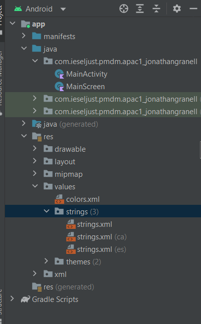
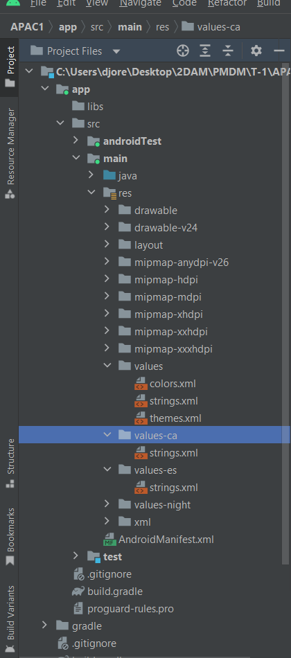

## APAC 1. Un formulari de Login
### Codi de les activitats
- **Accedir als diferents elements de la interficie**

    ~~~
    override fun onCreate(savedInstanceState: Bundle?) {
        super.onCreate(savedInstanceState)
        setContentView(R.layout.activity_main)
        val usuari = findViewById<EditText>(R.id.editTextTextUsername)
        val contrasenya = findViewById<EditText>(R.id.editTextTextPassword)
        val textViewIntentos = findViewById<TextView>(R.id.textViewAttempts)
        val btLogin = findViewById<Button>(R.id.btLogin)
    ~~~

    Al codi veiem que dins de la funció onCreate definim una serie de constants les quals fan referencia a la vista del mainActiviti.kt i fan referencia al layout escrit amb XML, definim una constant amb val nom = fem referencia a la id del fitxer xml on estan tots els elements de la vista definits.
    A continuacio un exemple del fitxer mainActiviti.xml

    ~~~
     <EditText
        android:id="@+id/editTextTextUsername"
        android:layout_width="0dp"
        android:layout_height="wrap_content"
        android:layout_marginStart="32dp"
        android:layout_marginTop="32dp"
        android:layout_marginEnd="32dp"
        android:ems="10"
        android:hint="Username"
        android:inputType="textPersonName"
        android:minHeight="48dp"
        app:layout_constraintEnd_toEndOf="parent"
        app:layout_constraintHorizontal_bias="0.0"
        app:layout_constraintStart_toStartOf="parent"
        app:layout_constraintTop_toBottomOf="@+id/imageView" />
    ~~~
    Aquest codi es la vista amb editor xml.

    També podem botar de una activitat a altra i amb el codi mostrat es pot fer posible. 
    Definim un objecte de la clase Intent fent referencia a l'altra activitat anomenada MainScreen, despres li pasem el valor de user que fa referencia al nom de usuari ja que el necesitarem, en cas de no necesitar ningun valor aquest pas no sería necesari.
    Per finalitzar startActivity intent per pasar a la següent activitat.
    ~~~
    val intent = Intent(baseContext, MainScreen::classjava)
    intent.putExtra("User", user)
    startActivity(intent)
    ~~~

- **Fitxer mainfest**
  
    Al fitxer mainfest apareixen dues activitats configurades, son MainScreen i MainActivity
    ~~~
     <activity
            android:name=".MainScreen"
            android:exported="false">
            <meta-data
                android:name="android.app.lib_name"
                android:value="" />
        </activity>
        <activity
            android:name=".MainActivity"
            android:exported="true">
            <intent-filter>
                <action android:name="android.intent.action.MAIN" />

                <category android:name="android.intent.category.LAUNCHER" />
            </intent-filter>

            <meta-data
                android:name="android.app.lib_name"
                android:value="" />
        </activity>
    ~~~
    Les diferencies entre les dues activitats es que MainScren te menys etiquetes i valors ja que sols te definit el nom de l'activitat, el atribut de adroid:exportd esta a fals i una etiqueta de metadatos amb dos valors.
    Mentre que MainActivity el atribut adroid:exported esta en true,  te una etiqueta intent per a poder accedir a aquesta activitat i definirla com a la activitat principal i tambe la etiqueta de metadatos.
    
    Avans hem parlat del atribut adroid:exported, anem a aprofundir mes en ell:

    android:exported

        Aquest element estableix si els components d'altres aplicacions poden iniciar l'activitat:
        Si és "true", qualsevol app pot accedir a l'activitat i es pot iniciar amb el nom de classe exacte.
        Si és falsa, l'activitat només es pot iniciar amb components de la mateixa aplicació, aplicacions amb el mateix ID d'usuari o components del sistema amb privilegis. Aquest és el valor per defecte quan no hi ha filtres d'intents.

#### Traduccions

En esta imatge veiem la vista de android la carpeta values que conte tres archius de String, un archiu per a cada idioma, cada arxiu conte unes traduccions.

Inicialment sols hi ha un archiu.

Aquesta imatge mostra el mateix en la vsista de project files. En aquesta vista veiem que no se ha creat un archiu per a cada idioma sino que se han creat una carpeta per a cada idioma traduit.

###### Contingut dels archius

Idioma original

~~~
<resources>
    <string name="app_name">APAC1_JonathanGranell</string>
    <string name="intentos">Failed attempts:</string>
    <string name="usuari">Username</string>
    <string name="contrasenya">Password</string>
    <string name="login">LOGIN</string>
    <string name="welcome">Welcome</string>
</resources>
~~~

Idioma Valenciá

~~~
<?xml version="1.0" encoding="utf-8"?>
<resources>
    <string name="app_name">APAC1_JonathanGranell</string>
    <string name="intentos">Intents Fallats:</string>
    <string name="usuari">Usuari</string>
    <string name="contrasenya">Contrasenya</string>
    <string name="login">INICIAR SESSIÓ</string>
    <string name="welcome">Benvingut</string>
</resources>
~~~

Idioma Espanyol

~~~
<?xml version="1.0" encoding="utf-8"?>
<resources>
    <string name="app_name">APAC1_JonathanGranell</string>
    <string name="intentos">Intentos Fallidos:</string>
    <string name="usuari">Usuario</string>
    <string name="contrasenya">Contraseña</string>
    <string name="login">INICIAR SESIÓN</string>
    <string name="welcome">Bienvenido</string>
</resources>
~~~